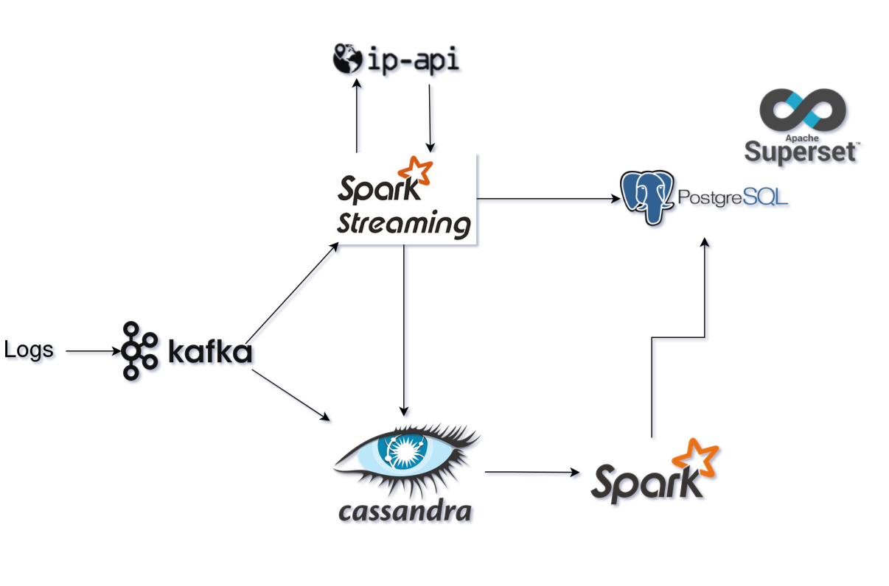
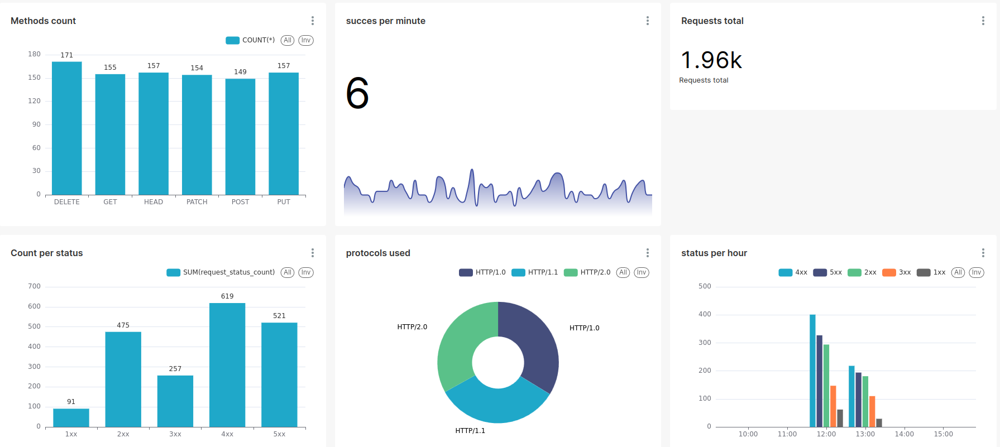
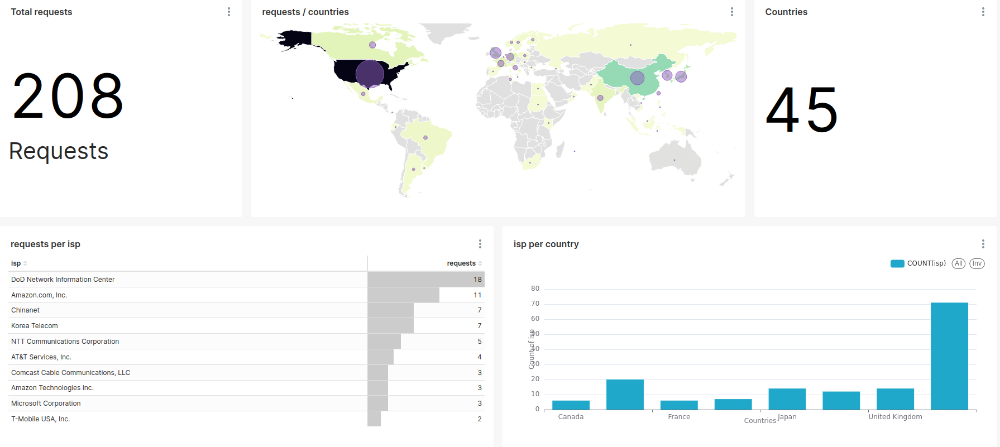

# LambdaLogs

LambdaLogs is a **Data Engineering** project where I implement the **Lambda Architecture** to process and analyze logs in real-time and batch modes.

The objective of this pipeline is to analyze logs from web applications. While this project uses a dummy log generator, it can easily be adapted to process real log data from production systems. This allows for insights into web traffic, user behavior, and system events.

## 2 processing layers:

- Speed layer: 
    In this layer data is processed in real-time to give informations about the requests.   
    
    

- Batch layer: 
    This layer helps us know where the traffic is coming from, we can trigger this every hour, day... 
    